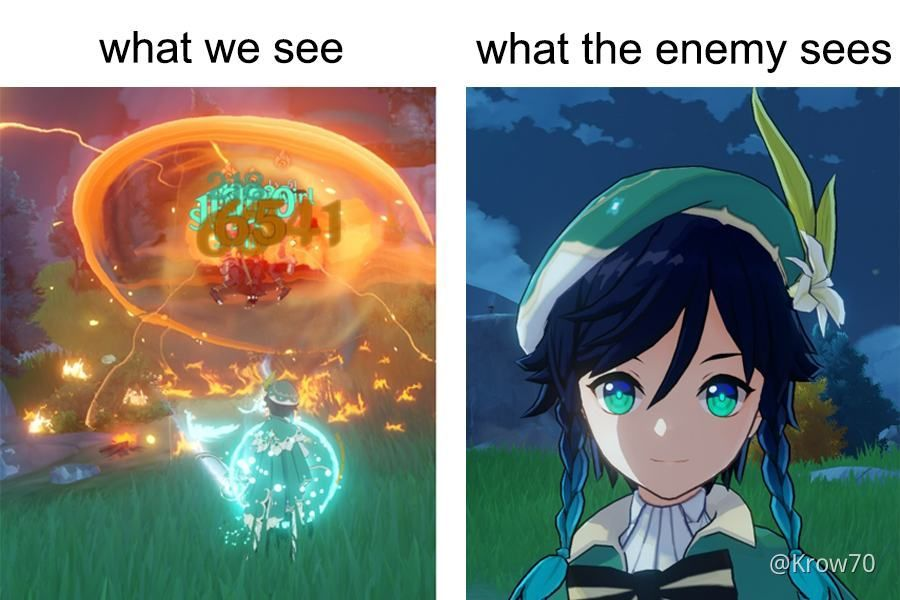
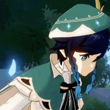

# HTML Code Explanation: Images and Attributes

## Code Overview
The provided HTML code demonstrates how to use images in a webpage. It showcases the usage of different attributes to enhance image handling, including linking images to other pages and displaying alternative text when the image fails to load.

```html
<!DOCTYPE html>
<html>
    <head>
        <title>Images</title>
    </head>
    <body>

        <h1>This is a random meme</h1>

        <a href="https://genshin-impact.fandom.com/wiki/Venti">
         <!--If the image doesnt load alt show a text-->
        </a>

        

        <h3>Description goes here..?</h3>
    </body>

</html>
```

---

## Explanation of Elements and Attributes

### ``: The Image Tag
The `` tag is used to embed images in an HTML document. It is a self-closing tag that requires at least the `src` attribute to specify the image source.

#### Attributes Used:

1. **`src` (Source)**:
   - Specifies the path or URL of the image.
   - Example: `src="image2.jpg"` points to an image file named `image2.jpg` in the current folder.

2. **`alt` (Alternative Text)**:
   - Provides alternative text to display when the image cannot be loaded.
   - Useful for accessibility and in cases where the image fails to load.
   - Example: `alt="This is a picture of venti"` displays the text if the image fails to load.

3. **`height`**:
   - Specifies the height of the image in pixels.
   - Example: `height="200"` sets the height to 200 pixels. The width adjusts proportionally unless otherwise specified.

### `<a>`: The Anchor Tag
The `<a>` tag is used to create hyperlinks. In this case, it wraps around an image to make the image clickable, linking to another webpage.

#### Attributes Used:

1. **`href` (Hyperlink Reference)**:
   - Specifies the URL the link points to.
   - Example: `href="https://genshin-impact.fandom.com/wiki/Venti"` links to Venti's Genshin Impact fandom page.

2. **`title` (Optional, Not Used Here)**:
   - Adds a tooltip that appears when hovering over the link.

### Additional Elements

1. **`<h1>` and `<h3>`**:
   - Used for headings.
   - Example: `<h1>` creates a large heading, while `<h3>` creates a smaller subheading.

2. **Alt Text for Accessibility**:
   - Both images include meaningful `alt` attributes describing the content, which enhances accessibility for users with screen readers.

---

## Key Features

1. **Clickable Image**:
   - The first image is wrapped in an `<a>` tag, making it a clickable link.

2. **Alternative Text**:
   - Provides a description of the images for accessibility and error handling.

3. **Resized Images**:
   - The `height` attribute ensures that images are uniformly resized for display.

4. **GIF Support**:
   - Demonstrates embedding a `.gif` file.

---

## Example Output
- The page displays a heading, a clickable image linking to an external webpage, a GIF below it, and a subheading for description.
